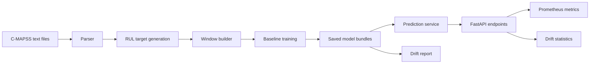

# Architecture

## Overview

The project is organized as a Python package with separate modules for data ingestion, feature generation, baseline modeling, training orchestration, inference, API serving, monitoring, and evaluation.

## Components

`industrial_maintenance_mlops.data` parses C-MAPSS train, test, and RUL files and generates RUL labels for engine trajectories.

`industrial_maintenance_mlops.features` builds fixed-length windows from ordered time-series data and converts RUL labels into failure-risk classification targets.

`industrial_maintenance_mlops.models` contains deterministic sklearn baseline training helpers and model persistence utilities.

`industrial_maintenance_mlops.training` loads configuration, runs the baseline training workflow, writes metrics, saves model bundles, and stores reference statistics for drift checks.

`industrial_maintenance_mlops.inference` loads saved model bundles and validates incoming prediction windows before calling the underlying estimator.

`industrial_maintenance_mlops.api` exposes FastAPI endpoints for health checks, RUL prediction, failure-risk prediction, batch prediction, and Prometheus-compatible metrics.

`industrial_maintenance_mlops.monitoring` tracks request and prediction metrics, compares incoming windows against saved reference mean and standard deviation, and can write drift reports from final test-engine windows.

## Data Flow

Raw C-MAPSS files are expected in `data/raw/CMAPSSData/`. Training reads those files, derives labels, builds windows, trains baseline models, and writes local artifacts under `models/` and `reports/metrics/`.

The API loads model bundles from `models/`. Each prediction request must provide a numeric sensor window with the configured shape. The service returns model version, prediction output, request latency, and metadata.

The drift-report workflow loads `models/reference_stats.json`, extracts the final fixed-length window for each test engine, compares current feature statistics with training reference statistics, and writes a local JSON report under `reports/metrics/`.
