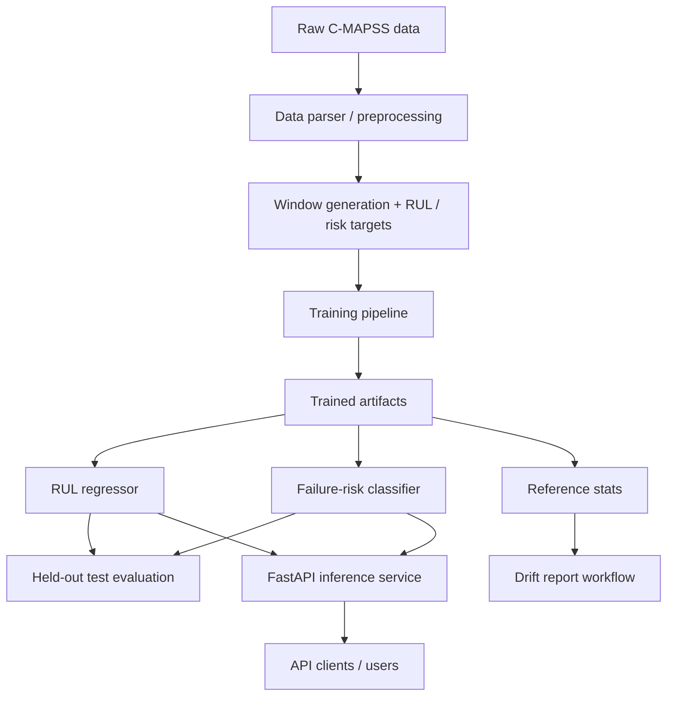

# Architecture

## Overview

The project is a local Python package organized around the C-MAPSS predictive
maintenance workflow: parse turbofan time-series data, build RUL targets and
sensor windows, train baseline models, evaluate held-out test engines, serve
local model bundles, and generate lightweight monitoring outputs.

## Component Explanation

- Raw C-MAPSS data: local NASA turbofan text files under
  `data/raw/CMAPSSData/`.
- Data parser / preprocessing: reads train, test, and RUL files into typed
  tabular data.
- Window generation + targets: creates fixed-length sensor windows, clipped RUL
  targets, and failure-risk labels.
- Training pipeline: fits baseline RUL regression and failure-risk
  classification models with an engine-level validation split.
- Trained artifacts: local joblib model bundles and reference statistics under
  `models/`.
- Held-out test evaluation: scores the final available test window per engine
  against `RUL_FD001.txt`.
- Drift report workflow: compares final test-engine window statistics with
  training reference statistics.
- FastAPI inference service: loads local model bundles and serves RUL,
  failure-risk, batch, health, and metrics endpoints.
- API clients / users: callers that submit validated sensor windows and consume
  prediction responses.

## Package Areas

`industrial_maintenance_mlops.data` reads C-MAPSS train, test, and RUL files and
generates RUL labels.

`industrial_maintenance_mlops.features` selects feature columns, builds
fixed-length windows, flattens windows for sklearn estimators, and derives
failure-risk labels.

`industrial_maintenance_mlops.models` trains sklearn baselines and saves joblib
model bundles with inference metadata.

`industrial_maintenance_mlops.training` runs the FD001-style training workflow,
including engine-level validation split, metrics output, model bundle saving,
and reference-statistics creation.

`industrial_maintenance_mlops.evaluation` evaluates saved model bundles on
held-out C-MAPSS test engines using the final available window per engine.

`industrial_maintenance_mlops.inference` loads saved bundles and validates
incoming windows before prediction.

`industrial_maintenance_mlops.api` exposes FastAPI endpoints for health checks,
RUL prediction, failure-risk prediction, batch prediction, and metrics.

`industrial_maintenance_mlops.monitoring` provides API counters/histograms,
single-window drift checks, and JSON drift reports comparing final test-engine
windows against training reference statistics.

## Local Artifacts

Raw data is expected under `data/raw/CMAPSSData/`. Training and evaluation write
local artifacts under `models/` and `reports/metrics/`. These generated files
are ignored by Git.

Typical generated files:

- `models/rul_regressor.joblib`
- `models/failure_risk_classifier.joblib`
- `models/reference_stats.json`
- `reports/metrics/training_metrics_FD001.json`
- `reports/metrics/test_metrics_FD001.json`
- `reports/metrics/drift_report_FD001.json`
